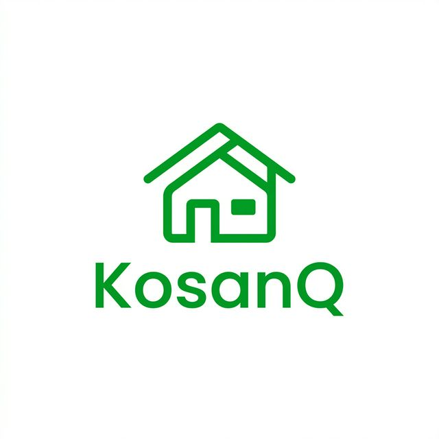

# KosanQ 👋
**Platform Manajemen & Penyewaan Kos Terintegrasi**




---

## 🚦 Memulai (Getting Started)

Untuk menjalankan proyek ini di lingkungan lokal Anda, ikuti langkah-langkah berikut:

1. **Install Dependencies**
   ```bash
   npm install
   ```

2. **Jalankan Aplikasi**
   ```bash
   npx expo start
   ```

3. **Gunakan Perangkat**
   Tekan `a` untuk Android, `i` untuk iOS, atau scan QR code di terminal menggunakan aplikasi Expo Go.

---

## 📑 Dokumentasi Aplikasi (Pitch Deck)

Berikut adalah detail lengkap mengenai aplikasi untuk kebutuhan presentasi kepada audiens atau investor:

### 1. Deskripsi Aplikasi
KosanQ adalah solusi **End-to-End** untuk manajemen hunian sewa. Berbeda dengan direktori tradisional, kami menangani proses mulai dari pencarian, booking, hingga manajemen pembayaran dan komunikasi harian antara pemilik dan penghuni.

### 2. Fitur-Fitur Utama
*   **Pencarian Berbasis Lokasi:** Integrasi Google Maps untuk pencarian kamar strategis.
*   **Real-time Messaging:** Chat langsung di dalam aplikasi untuk efisiensi komunikasi.
*   **Tenant & Payment Management:** Dashboard khusus pemilik untuk memantau penghuni dan riwayat keuangan.
*   **Loyalty & Vouchers:** Membangun ekosistem yang menguntungkan bagi penghuni tetap.

### 3. Keunggulan Kompetitif
*   **Post-Booking Focus:** Tidak hanya iklan, tapi alat bantu operasional.
*   **Sync Real-time:** Menggunakan Firebase untuk pembaruan data tanpa delay.
*   **Multi-Role Access:** Admin, Owner, dan User dalam satu platform terpadu.

### 4. Keamanan Data (Security)
*   Menggunakan **Firestore Security Rules** untuk isolasi data antar pengguna.
*   Autentikasi aman melalui **Firebase Auth**.
*   Logika bisnis terlindungi pada level server-side.

---

## 🛠️ Stack Teknologi
*   **Core:** React Native & Expo SDK 54
*   **Backend:** Firebase (Cloud Firestore, Auth, Storage)
*   **Navigation:** Expo Router
*   **UI/UX:** Reanimated & Vector Icons

---

## 👤 Identitas Pengembang

**Developer:** AkuuuEL
**Portfolio:** [akuuuel/Portfolio_AkuuuEL](https://github.com/akuuuel)
**Project Version:** 1.0.0

---
*© 2026 KosanQ.app - Memudahkan Hunian, Menyamankan Masa Depan. Licensed under [MIT License](LICENSE).*
